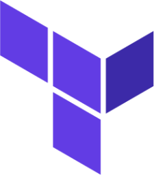

#  terraform

Obraz Dockerowy z narzędziem Terraform.

---
## Contributions
Jeśli masz pomysły na ulepszenia, zgłoś problemy, rozwidl repozytorium lub utwórz Merge Request. Wszystkie wkłady są mile widziane!
[Contributions](CONTRIBUTING.md)

---
## License
Projekt licencjonowany jest na warunkach [Licencji MIT](LICENSE).

---
# Author Information
### &emsp; Maciej Rachuna
# 

